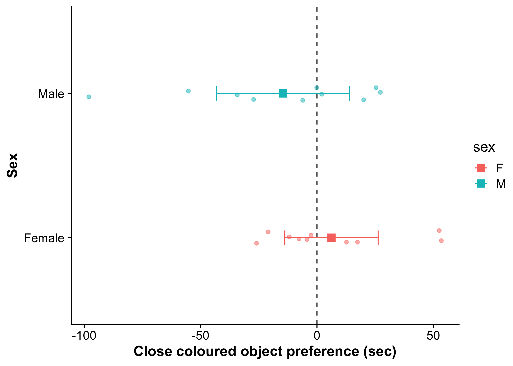

<a href="index.html">My File Drawer</a>
<a href="https://github.com/wyatt-toure/file-drawer-research" style = "float: right;">GitHub</a>

<button class="dropbtn">Analyses </img></button>

<a href="guppy-colour-vs-bw-object-choices-analysis.html">Guppy preferences for colour</a>
<a href="guppy-novel-object-recognition-analysis.html">Guppy novel object recognition</a>
<a href="guppy-colour-learning-v1-analysis.html">Guppy colour learning v1</a>

<button class="dropbtn">Reports </img></button>

<a href="guppy-colour-vs-bw-object-choices-report.html">Guppy preferences for colour</a>
<a href="guppy-novel-object-recognition-report.html">Guppy novel object recognition</a>
<a href="guppy-colour-learning-v1-report.html">Guppy colour learning v1</a>

<a href="index.html" style = "float: right;">Home</a>

M. Wyatt Toure

e-mail: `m_wyatt.toure@mail.mcgill.ca`

***

## Introduction

The goal of this pilot project was to determine whether there was a detectable preference for colourful objects in Lego-naive guppies *i.e* guppies that had never seen Lego blocks. This was important for my later experiments which relied heavily on the use of Legos. There is evidence across natural as well as laboratory raised guppy populations that a response bias for carotenoid colours exist. I did a simple experiment. 20 domestic guppies, 10 males and 10 females, were exposed to both a colourful (red, orange, and yellow) object as well as a black and white object.

## Materials and Methods

### Subjects

I used 20 domesticated, laboratory-reared, guppies. Of these 20 guppies 10 were males and 10 were females.

### Testing

Fish were taken directly from the experimental stock tanks to the testing tank via a white opaque transfer cup. The test tank was an X-L *l* cm x *w* cm x *h* cm tank with white corrugated plastic walls and white laminated paper base to allow for automated behavioural tracking. I placed the guppies within a transparent glass holding cylinder for 2 minutes to allow for habituation to the tank transfer. After this habituation period I lifted the release cylinder and left the room. The guppy was then given 10 minutes to freely move about the tank.

### Statistical analysis

Data were analysed using R statistical software (Version 3.6.2 R Core Team). I used linear models to ask whether the time spent on the side of the tank with the coloured object and/or the time spent near the coloured object was significantly different from chance and whether this was influenced by sex.

## Results and Discussion

{style="display: block;   margin-left: auto;   margin-right: auto;" width="600"}
