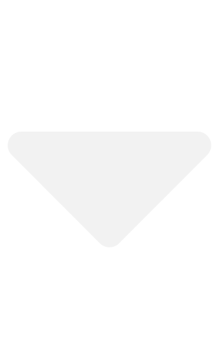

<a href="index.html">My File Drawer</a>
<a href="https://github.com/wyatt-toure/file-drawer-research" style = "float: right;">GitHub</a>

<button class="dropbtn">Analyses </img></button>

<a href="guppy-novel-object-recognition-analysis.html">Guppy novel object recognition</a>
<a href="guppy-colour-learning-v1-analysis.html">Guppy colour learning v1</a>

<button class="dropbtn">Reports </img></button>

<a href="guppy-novel-object-recognition-report.html">Guppy novel object recognition</a>
<a href="guppy-colour-learning-v1-report.html">Guppy colour learning v1</a>

<a class="active" href="index.html" style = "float: right;">Home</a>

M. Wyatt Toure

McGill University, Department of Biology, 1205 Docteur Penfield, Montreal, Quebec H3A 1B1, Canada

e-mail: `m_wyatt.toure@mail.mcgill.ca`

***

## Introduction

There is some evidence that guppies can distinguish between familiar and novel objects behaviourally. Adult guppies spend more time in close proximity of a novel rather than a familiar object [@lucon-xiccato2016GuppiesShowBehavioural] while newborn guppies spend more time near a familiar rather than a novel object [@milettopetrazzini2012DevelopmentApplicationNew]. However, the study on adult guppies used a domestic strain of guppies that had been in the lab for over 15 years. Since the population and captivity history of these guppies differed from ours it is possible that our guppies might display different reactions to novelty. I performed my own novel object recognition test on our ISO-Y guppies and used multiple objects to provide more evidence that novelty, and not something idiosyncratic to a particular object, is the key feature being responded to.

## Materials and Methods

### Subjects

I used 24 ISO-Y fish in this experiment. Adult male and female guppies were
housed in 5-gallon tanks fitted with a heater, filter, and artificial plant.
Water temperature was maintained between 24 and 27 degrees Celsius. Fish were
fed once daily with Tetramin flake food and kept on a 12-h light/dark cycle.

### Experimental setup and testing of object preference

The objects were Lego blocks purchased from a local toy store (Tour de jeux). 8
different Lego blocks were used in total. Two tanks received the same pair of
objects, but which object of the pair was novel was counterbalanced across tank
pairs. I placed an object in the center of the guppy home tank at 9 am for 24
hours. Then the next day I gave the fish two consecutive tests. The guppies were
coaxed into a cup and then gently poured into a clear release cup placed in the
center of a test tank. The test tank was a tank separate from their home tank
filled to a water level of 7 cm. Guppies were given 90 seconds inside this clear
release cup to acclimate from handling and to their new surroundings for both
tests.

For the first test, guppies were presented with two duplicates of the familiar
object which were placed on both sides of the tank. I undertook the double
exposure to ensure that the familiar object became familiar and that I had a
baseline measure of behaviour towards a familiar object. After the first test
trial, the guppy was transferred via a cup to a holding tank that is identical
to the testing tank for a 1-minute retention interval. This retention interval
was chosen because this was shown to lead to the strongest object recognition
behaviour in zebrafish whereas other retention intervals did not have similar
effects (May et al. 2016). Once the retention interval was over the guppy was
transferred back to the testing tank where one of the familiar objects had been
replaced with a novel object. The fish were then given another 10 minutes to
move about the tank. The side the novel object was placed on was balanced across
all fish tested.
 
### Behavioural measures

EthoVision XT motion tracking software (version 11.5, Noldus et al. 2001) was
used to quantify object preference metrics. The object preference metric was the
time within a 4cm by 4cm square around the familiar or novel object.

### Statistical analysis

Within a trial I took the proportion of time spent with novel object compared to
the familiar object. In other words when spending time with one of the two
objects how much proportion of that time was spent with the novel rather than
the familiar object. The proportion should be greater than 0.5 if the fish are
spending more time with the novel object in the trial. To look at this I used a
generalized linear model and compared the proportion of time near the novel
object against chance (50%). Additionally, between trials I took the proportion
of time spent with the object in the location where the novel object was going
to be placed in the second test trial and compared it to the proportion of time
spent in that location when the novel object was placed there. If the tested
guppy is more likely to engage with novelty i.e. neophilic, I would expect the
proportion of time the guppy spends in the novel object location to increase
when the novel object is there compared to when the familiar object is there. I
used a generalized linear mixed model to investigate this and looked at whether
the proportion of time on the side with the novel object increased when a novel
object was placed there. 
