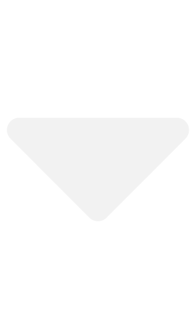

<a href="index.html">My File Drawer</a>
<a href="https://github.com/wyatt-toure/file-drawer-research" style = "float: right;">GitHub</a>

<button class="dropbtn">Analyses </img></button>

<a href="guppy-novel-object-recognition-analysis.html">Guppy novel object recognition</a>
<a href="guppy-colour-learning-v1-analysis.html">Guppy colour learning v1</a>

<button class="dropbtn">Reports </img></button>

<a href="guppy-novel-object-recognition-report.html">Guppy novel object recognition</a>
<a href="guppy-colour-learning-v1-report.html">Guppy colour learning v1</a>

<a href="index.html" style = "float: right;">Home</a>

M. Wyatt Toure

e-mail: `m_wyatt.toure@mail.mcgill.ca`

------------------------------------------------------------------------

## Introduction

The goal of this project was to determine whether I could induce preferences for specific objects in guppies. For my MSc thesis I wanted to determine whether novel object preferences could be shifted in guppies. Before I could do that I needed to establish that pairing food reinforcement with specific objects was enough to induce a preference for a particular object. The use of food reinforcement to shape behaviour has been used successfully in birds to shape social behaviours which persisted outside the specific contexts in which the behaviours were rewarded [@firth2015experimental]. However, whether adult guppies can have their preferences selectively shaped for specific objects is unclear. We know guppies are capable of associative learning as they have been shown to associatively learn which colours are associated with a profitable foraging patch [@dugatkin2003BoldnessBehavioralInhibition; @trompf2014PersonalityAffectsLearning]. Additionally it seems they do so more successfully with colours than with shape [@lucon-xiccato2019GuppiesLearnFaster]. However, there are cases where associative learning has not been observed. In one experiment it was found that mild maternal stress led to offspring not being able to learn the association between a colour cue and food reward [@eaton2015MildMaternalStress]. In this pilot I wanted to establish whether an instrumental conditioning paradigm whereby guppies were rewarded with food reinforcement for approaching particular objects would induce a preference for that rewarded object in our Paria-derived guppies. I also wanted to gather data on potential colour biases in case there were colours that were particularly preferred which could inform object colour selection for my future experiments.

## Materials and methods

### Subjects

In this experiment I used 36 fish, 12 Helen's Paria and 24 Helen's ISO-Y. The two populations never differed significantly in any phenotypic measures and they are from the same drainage so I present the pooled data.

### Object preference tests

I took measurements of object preference at two time points. One prior to training and one after training. Both sets of test objects were duplicates of the training objects but never had food placed on them nor were they ever placed in fish tanks. This was to ensure no cues other than object identity would be available to the guppy.

### Training

Subjects were trained in their home tanks to minimize stress brought upon by tank transfers. During training the reinforced object had a food strip attached to it via Velcro. This food strip contained Tetramin flake food and gelatin attached to a piece of plastic. A second unreinforced object had this same food strip but no food. The objects with their food strips were placed in the tanks and the fish allowed to feed for 20 minutes after which they were removed from the tank. This happened twice a day, morning and afternoon, for 5 days. The objects were placed in random locations of the tank daily to prevent the use of spatial information. The objects were placed in the tank such that the food strip was always facing away from the fish so they had to approach and go around the object to discover the food, this was done to force interaction with the object with the intention of aiding the formation of an association.

### Behavioural measures

Fish movement was recorded by a camcorder (Sony FDR-AX100 4K Ultra HD Camcorder) mounted above the tank. EthoVision XT motion tracking software (version 7, Noldus et al. 2001) was then used to quantify object preference metrics and activity metrics from video footage. The object preference metric was the amount of time spent near an object subtracted by the amount of time spent near the other object. The object zone was demarcated by an AxB cm zone around the object (Fig. X). Increased preference for an object is expected to be expressed behaviourally by 1) increased time spent near an object, decreased latency to visit an object, and/or 3) more visits to an object. The activity metrics were: Distance moved, time spent in the center, and time spent in the periphery.

### Statistical analysis

Data were analyzed using R statistical software (Version 3.6.2, R Core Team). I used a combination of linear models, linear mixed models, and generalized linear mixed models depending on the distributional assumptions of the data. Data which involved repeated measures were analysed using mixed models with a random intercept of individual ID. Models were checked they met distributional assumptions using the R package DHARMa [@hartig2020dharma].

I looked at whether there was an influence of the colour of an object on any of my three metrics of object preference ((latency to object, number of visits to object, and time spent in close proximity to object). To do this I fitted three linear models with a fixed effect of object primary colour and each of the three object preference response variables.

I also looked at whether there is a difference in initial (prior to training) preference for the trained object and untrained object. To do this I fitted a linear mixed model with a varying intercept of individual ID and a fixed effect of object type (trained or untrained), however this gave me a singular fit as of July 8, 2019 so instead I fitted three separate linear models with a fixed effect of object type and the three object preference metrics as a response variable, one for each model.

## Results and Discussion

### Object Colour

At baseline there was no significant effect of object colour on any metric of object preference, all fixed effects came out non-significant (P > 0.05). In another analysis I may group all the carotenoid colours and all the non-carotenoid colours and compare them. Also, I should compare first 5 minutes and last 5 minutes. Based on this there was not a particular colour biasing object preference at baseline.

### Trained object preference

There is no effect of object type on any of the object preference metrics prior to training, all differences were small and non-significant (difference in time spent with the different object types is 1.5 seconds, difference in latency to objects is 5.3 seconds and difference in visits to objects is 0.5 visits, P > 0.2 for all three). There was therefore no initial preference for one object over another.

### Conclusions

Object preferences were not shifted in a significant fashion. This may be overcome with different training techniques and with a better idea of how guppies spend time with objects when there is actually food there. 

For a next attempt, I think it would be good to train guppies in a duplicate of the test tank. There is an extensive literature in psychology on contextual learning which suggests that such a massive change in context between training and testing could be impacting our results. The fact that I was able to elicit a behavioural response to novelty when one of the familiarization periods was held in the test tank whereas beforehand when I was familiarizing them in the home tank only I was unable to get a response lends some limited evidence to this. Limited because I also exposed them in their home tank and for a greatly extended period of time so it is unclear which had the greater effect. My hunch is that similar training contexts help. Repeated exposure to the test tank environment and restricting feedings to only the test tank environment will be employed in order to XYZ. As I write this now what I can say is that overwhelmingly the response to guppies in the tank is to not feed. Currently training bouts are five minutes long.

I also think that should this be successful; we could forego the familiarity rewarded control condition. I am wondering about having a treatment where the guppies are not exposed to novelty at all.

## Post-Mortem 

Of experiments Ronald Fisher, the father of frequentist statistics said

>*To consult the statistician after an experiment is finished is often merely to ask him to conduct a post mortem examination. He can perhaps say what the experiment died of.*

There were a number of things I would have done differently looking back at this experiment. I would have had the same untrained object across all fish, perhaps something neutral like a white or gray block so that I did not have to worry about both the colour of the trained *and* untrained object. This ends up slicing up my samples into such different conditions that it makes it almost impossible, with my sample size to deduce whether any trends that are seen are due to the trained object being more attractive than the untrained object or the untrained object being more attractive than the trained object. 

All these lessons led me to take a different approach in my next experiment. In version 2 of guppy colour learning I decided to train guppies individually in their test tanks to one pair of objects, a blue and green one. Half the guppies were trained to green and the other half were trained to blue. This project is documented at https://wyatt-toure.github.io/guppy-colour-learning-project/  

## References
