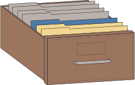

# Wyatt Toure's File Drawer: A living collection of filed away experiments

I've had a good deal of experiments that either did not pan out, were flawed, 
or simply may not be very high impact *e.g.* replications. I thought it would 
be a shame for those experiments to live in my computer for all eternity. I 
decided to write up these projects and the analyses I did on the data from these 
projects mainly for other lab members to learn from my mistakes but also for 
anyone who happens to stumble upon this. Each repository is a separate project 
and they are all hosted on the site:

[wyatt-toure.github.io/toure-file-drawer-research](wyatt-toure.github.io/toure-file-drawer-research)

## Project summaries 

The main question of my thesis was to determine whether I could shift novel 
object preferences in Trinidadian guppies. Before I attempted to do this I 
wanted to establish two things. 1) guppies can recognize and respond 
behaviourally to novelty and 2) guppies can have their preferences for 
specific objects shifted via food reinforcement. These gave rise to the
following two experiments.

- Novel object recognition in Trinidadian guppies 

- Shifting object preferences in Trinidadian guppies (version 1)
